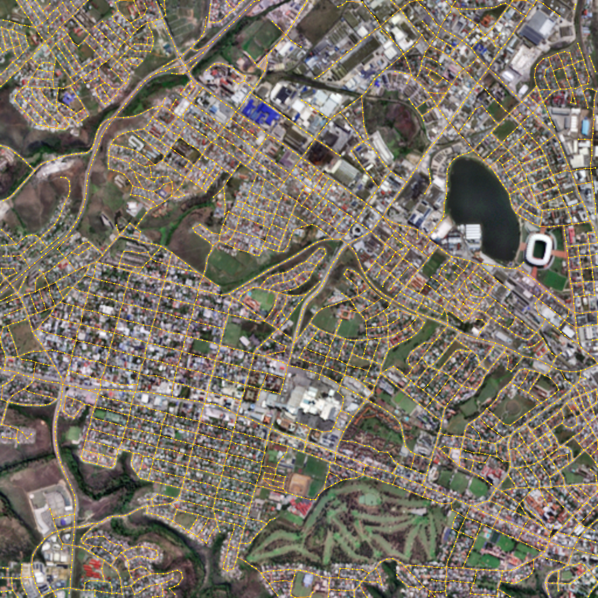

## Abstract
There is growing interest in utilising medium-resolution satellite imagery in monitoring road developments over time, as a cost-effective alternative to high-resolution images. However, road extraction from medium-resolution satellite imagery remains a challenging and under-explored field compared to high-resolution road extraction. The Sentinel satellite program freely provides multi-band medium-resolution satellite imagery. The generalisation from high-resolution to medium-resolution Sentinel imagery presents unique challenges attributed to lower resolution and multi-band domain shift. Recent advancements in models for high-resolution road extraction, such as SAM-Road, conceivably require modifications for Sentinel imagery. To address the additional bands and lower resolution of Sentinel imagery, we apply bicubic upsampling as a pre-processing step to the SAM-Road model and explore backbone and CNN-based model changes to its road segmentation component. Additionally, we introduce ROSA, a diverse dataset consisting of various biomes and urbanisation locations in South Africa. Evaluated on the ROSA dataset, our modifications to SAM-Road achieve 49.79 APLS, a 2.69 APLS improvement over our baseline SAM-Road model by utilising additional bands. Furthermore, to support practical road extraction across South Africa, we integrate our model into InstaGeo, an end-to-end geospatial machine learning framework.



## Getting Started

### Installation

This project uses the [`uv`](https://docs.astral.sh/uv/) package manager

```bash
uv sync --all-extras
```
### Training

```bash
uv run python -m geosamroad.train --config src/geosamroad/configs/local/sam.yaml --dataset-dir /path/to/ROSADataset --sam-ckpt-path checkpoints/sam_pretrain/sam_vit_b_01ec64.pth
```

Useful flags:
- `--set KEY=VALUE` — override config key (e.g. `--set BATCH_SIZE=2 --set TRAIN_EPOCHS=20`)
- `--resume path/to/ckpt` — resume from a checkpoint

### Inference

Sliding-window inference over tiles in a split:

```bash
uv run python -m geosamroad.inferencer --config src/geosamroad/configs/local/sam.yaml --checkpoint checkpoints/sam/best.ckpt --split test --output-dir save/sam_output
```

### Evaluation

TOPO + APLS graph metrics over the predictions produced:

```bash
uv run python -m geosamroad.eval_graphs --pred-dir save/sam_output/graph --dataset-dir /path/to/ROSADataset --split test
```

## Acknowledgement
- [Segment Anything Model](https://github.com/facebookresearch/segment-anything)  
- [SAM_Road](https://github.com/htcr/sam_road) 
- [Sat2Graph](https://github.com/songtaohe/Sat2Graph)
- [SAMed](https://github.com/hitachinsk/SAMed)  
- [Detectron2](https://github.com/facebookresearch/detectron2)  